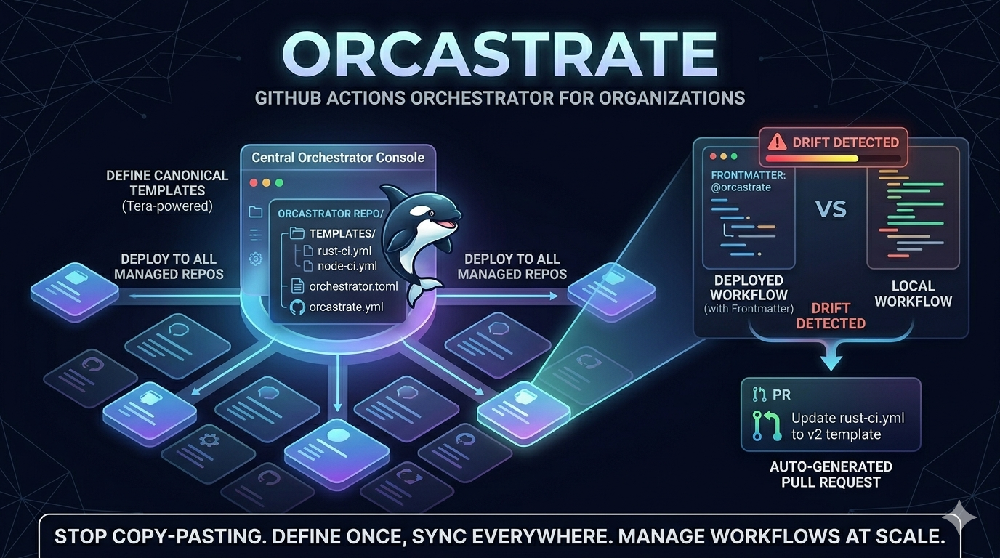

<p align="center">
  
</p>

> Stop copy-pasting workflow files across repos. Define canonical templates once, sync them everywhere, and get PRs when repos drift.

## How it works

```
orchestrator repo
├── orchestrator.toml          # which repos to manage
├── templates/
│   ├── rust-ci.yml            # Tera-powered workflow templates
│   ├── node-ci.yml
│   └── pr-title.yml
└── .github/workflows/
    └── sync.yml               # scheduled Action that runs orcastrate
```

Orcastrate runs as a scheduled GitHub Action in your central orchestrator repo. On each run it:

1. Reads your repo list from `orchestrator.toml`
2. Scans each repo's `.github/workflows/` for files with `@orcastrate` frontmatter
3. Renders the referenced template with the declared params
4. Compares the rendered output against the current file
5. Opens one PR per drifted workflow

## Managed workflow frontmatter

Workflow files opt in to management via a comment block at the top:

```yaml
# @orcastrate
# template: rust-ci
# params:
#   toolchain: stable
#   features: ["serde", "async"]
# @end-orcastrate

name: CI
on: [push]
# ... rest of workflow managed by orcastrate
```

Only files with this block are touched. Everything else is ignored.

## Quick start

### 1. Create the orchestrator repo

Create a new repo in your org (e.g. `myorg/workflow-orchestrator`).

### 2. Add config

```toml
# orchestrator.toml

[orchestrator]
templates_dir = "templates"

[[repos]]
name = "myorg/service-api"

[[repos]]
name = "myorg/service-web"
```

### 3. Add a template

```yaml
# templates/rust-ci.yml

name: CI
on:
  push:
    branches: [{{ default_branch | default(value="main") }}]
  pull_request:
    branches: [{{ default_branch | default(value="main") }}]

jobs:
  test:
    runs-on: ubuntu-latest
    steps:
      - uses: actions/checkout@v4
      - uses: dtolnay/rust-toolchain@{{ toolchain | default(value="stable") }}
      - run: cargo test --all-features
```

### 4. Set up the scheduled Action

```yaml
# .github/workflows/sync.yml

name: Orcastrate Sync
on:
  schedule:
    - cron: "0 8 * * 1-5"
  workflow_dispatch:

permissions:
  contents: write
  pull-requests: write

jobs:
  sync:
    runs-on: ubuntu-latest
    steps:
      - uses: actions/checkout@v4
      - uses: dtolnay/rust-toolchain@stable
      - uses: Swatinem/rust-cache@v2
      - run: cargo install orcastrate
      - run: orcastrate --config orchestrator.toml sync
        env:
          ORCASTRATE_TOKEN: ${{ secrets.ORCASTRATE_TOKEN }}
          GITHUB_TOKEN: ${{ secrets.GITHUB_TOKEN }}
```

### 5. Add frontmatter to target repos

In each managed repo, add the frontmatter block to workflow files:

```yaml
# @orcastrate
# template: rust-ci
# params:
#   toolchain: stable
# @end-orcastrate

name: CI
# ... orcastrate will manage the rest
```

## CLI usage

```
orcastrate sync                  # sync all repos, open PRs for drift
orcastrate sync --dry-run        # see what would change without modifying anything
orcastrate sync --repo org/repo  # sync a single repo
orcastrate validate              # check config + templates are valid
orcastrate drift                 # check drift status without creating PRs
orcastrate list-repos            # show configured + discovered repos
orcastrate list-templates        # show available templates
```

Verbosity: `-v` for debug, `-vv` for trace, `-q` for quiet.

## Configuration

### `orchestrator.toml`

```toml
[orchestrator]
templates_dir = "templates"        # where templates live
branch_prefix = "orcastrate/sync"  # PR branch prefix
pr_label = "orcastrate"            # label added to PRs
dry_run = false                    # global dry-run toggle

[[repos]]
name = "myorg/repo-a"

[[repos]]
name = "myorg/repo-b"
enabled = false                    # temporarily skip

# auto-discover repos by org topic
[discovery]
org = "myorg"
topic = "managed-workflows"
```

### Template params

Templates use [Tera](https://keats.github.io/tera/) (Jinja2-style) syntax. Params declared in frontmatter are injected at render time:

```yaml
# @orcastrate
# template: rust-ci
# params:
#   toolchain: nightly
#   features: ["serde", "tokio"]
#   default_branch: develop
# @end-orcastrate
```

Templates can use defaults: `{{ toolchain | default(value="stable") }}`

## Authentication

Orcastrate uses two tokens for different operations:

| Operation | Token | Why |
|---|---|---|
| Git writes (tree, commit, ref) | `ORCASTRATE_TOKEN` | Needs `workflows` scope for `.github/workflows/` files |
| PR creation, labels | `GITHUB_TOKEN` | PRs appear as `github-actions[bot]` |

### Setup

1. Create a **fine-grained PAT** with permissions: Contents (R/W), Pull requests (R/W), Workflows (R/W)
2. Add it as a repo secret named `ORCASTRATE_TOKEN`
3. `GITHUB_TOKEN` is provided automatically by GitHub Actions

### GitHub App (recommended for orgs)

For org-wide use, create a GitHub App instead of a PAT:

- **Repository contents**: Read & Write
- **Pull requests**: Read & Write
- **Workflows**: Read & Write

Install it on your org, then set:
- `ORCASTRATE_APP_ID`
- `ORCASTRATE_PRIVATE_KEY`
- `ORCASTRATE_INSTALLATION_ID`

## What gets PRed

When orcastrate detects drift, it opens **one PR per workflow file**:
- Branch: `orcastrate/sync/{workflow-name}` (e.g. `orcastrate/sync/pr-title`)
- Title: `chore(ci): sync \`pr-title.yml\` from template \`pr-title\``
- Unified diff in the PR body
- The `orcastrate` label for easy filtering

If a PR already exists for the same workflow, it updates the existing PR instead of creating a new one.

## Design decisions

- **No external server** — runs entirely within GitHub Actions
- **State in git** — config and templates are version-controlled, auditable
- **PR-based updates** — never force-pushes to your default branch
- **One PR per workflow** — review and merge each change independently
- **Opt-in per file** — only workflows with `@orcastrate` frontmatter are managed
- **Template validation** — rendered output is validated as YAML before opening a PR
- **Conventional commits** — PR titles and commits follow conventional commit format

## License

MIT
